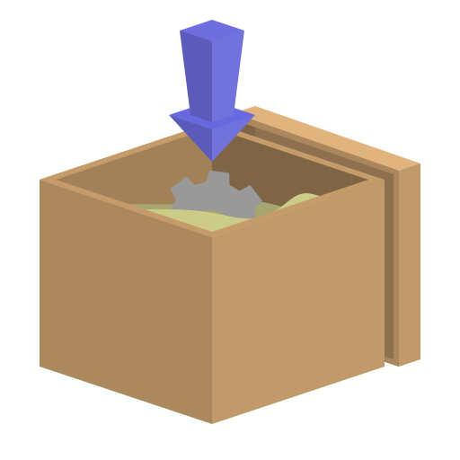

# aisap

<p align="center"></p>

AppImage SAndboxing Project (pronounced /eɪsæp/): a Go library to help sandbox
AppImages through bwrap

VERY EARLY DEVELOPMENT! Many parts of this are subject to change and should be
expected to until it reaches a more stable form

## What is it?
aisap intends to be a simple way to implement Android/Flatpak style sandboxing
with AppImages. It has a profile system, but it intends to keep it as basic as
possible, making it easier to understand what a program actually requires to
run without dealing with the hassle of individually cherry-picking files.

It currently has a basic re-implementaion of the go-appimage API, so modifying
existing GoLang programs to include sandboxing should be fairly painless

## Bare bones basics
In order for aisap to sandbox an AppImage, it requires a profile, which is a
desktop entry (INI format) containing at minimum the `Level` flag under the
`[X-App Permissions]` section, along with the following optional flags:
```
Files
Devices
Sockets
Share
```

These flags can be included in the AppImage's internal desktop file, another
desktop entry by use of the `--profile` command flag with aisap-bin, or aisap's
internal profile library, which is simply an arrary of permissions based on
known AppImage's names (the `Name` desktop entry flag)

The ultimate goal is to have as many AppImages in
[aisap's internal library](profiles/README.md) as possible, while smaller, less
known apps may request their own permssions per the developer. Running programs
sandboxed should mostly be seamless and feel native with the system

Unfortunately, I've been unable to find a Golang binding for squashfuse, so my
current *hacky* workaround is to simply use squashfuse's binary executable,
which needs to be in the same directory as any project that uses this library,
or installed on the host system. Once I get sandboxing to a more stable state,
I fully intend to create a proper binding of squashfuse for Golang, which would
certainly benefit more than this project (unless someone else wants to knock
that part out 😉)

For additional information on the permionnions system, see
[here](permissions/README.md)

## Usage of the aisap CLI tool
aisap CLI tool is a simple wrapper around the library to mainly serve as a
demonstration. It does *not* offer any desktop integration, but it should be
fairly easy to wrap it into shell scripts to automatically launch AppImages in.
I use it daily on my system and it generally works well, but there is no
guarantee everything will work as intended yet. If something isn't working,
send a bug report! I'll try to fix it ASAP

If an app is supported as listed [above](#bare-bones-basics), sandboxing it is
as simple as:
```
aisap f.appimage
```

It also includes these flags, which of course can be listed with `--help`:
```
normal options:
  -h, --help:        display this help menu
  -l, --list-perms:  print all permissions to be granted to the app
  -v, --verbose:     make output more verbose

long-only options:
  --example:            print out examples
  --level:              change the permissions level
  --root-dir:           use a different filesystem root for system files
  --data-dir:           change the AppImage's sandbox home location
  --no-data-dir:        force AppImage's HOME to be a tmpfs (default false)
  --add-file:           give the sandbox access to a filesystem object
  --add-device:         add a device to the sandbox (eg dri)
  --add-socket:         allow the sandbox to access another socket (eg x11)
  --rm-file:            revoke a file from the sandbox
  --rm-device:          remove access to a device
  --rm-socket:          disable a socket
  --extract-icon:       extract the AppImage's icon
  --extract-thumbnail:  extract the AppImage's thumbnail preview
  --profile:            use a profile from a desktop entry
  --version:            show the version and quit
```

## API:
### NewAppImage
```
NewAppImage(src string) (*AppImage, error)
```
Re-implementation from go-appimage, creates an AppImage struct

### (\*AppImage) Mount
```
(ai *AppImage) Mount(dest ...string) error
```
Takes an optional argument to mount at a specific location, if none given,
mount at a temporary directory under `$XDG_RUNTIME_DIR/aisap`

### (\*AppImage) Unmount
```
(ai *AppImage) Unmount() error
```
Unmount (shockingly) unmounts the requested AppImage. If \*AppImage.Mount()
is called, this function must be used before quitting or /tmp will be trashed
with mounted AppImages

### (\*AppImage) Run
```
(ai *AppImage) Run(args []string) error
```
If \*AppImage.Perms.Level > 0, Run() will sandbox the AppImage. Otherwise, it
will run normally (besides being mounted at a different location and
automatically getting a private $HOME directory). AppImage must be mounted in
order to use

### (\*AppImage) Sandbox
```
(ai *AppImage) Sandbox(args []string) error
```
Sandbox takes an AppImage and sandboxes it using the permissions offered,
failing if \*AppImage.Perms.Level == 0. AppImage must be mounted in order to
use

### (\*AppImage) WrapArgs
```
(ai *AppImage) WrapArgs() ([]string, error)
```
Takes aisap permissions and translates them into bwrap command line flags. This
can be used on its own to see what an AppImage *would* launch with, or to
manually launch it. AppImage must be mounted in order to use

### (\*AppImage) ExtractFile
```
(ai *AppImage) ExtractFile(path string, dest string, resolveSymlinks bool) error
```
Re-implementation from go-appimage, extract a file from the AppImage to `dest`.
If `resolveSymlinks` is set to false, the raw symlink will be extracted instead
of its target

### (\*AppImage) ExtractFileReader
```
(ai AppImage) ExtractFileReader(path string) (io.ReadCloser, error)
```
Re-implementation from go-appimage, like \*AppImage.ExtractFile(), but returns
a reader instead of automatically creating it

### (\*AppImage) Thumbnail
```
(ai AppImage) Thumbnail() (io.Reader, error)
```
Re-implementation from go-appimage, attempts to extract a thumbnail from the
AppImage if available. If provided in a format other than PNG (eg: SVG, XPM) it
attempts to convert it to PNG before serving

### (\*AppImage) Type
```
(ai AppImage) Type() int
```
Return the type of AppImage. Currently supports `2` (standard type 2) and `-2`
(non-standard shell-based AppImage, shImg). Plans on supporting type 1 in the
future, and type 3 whenever it is released

### (\*AppImage) TempDir
```
(ai AppImage) TempDir() string
```
Returns the AppImage's temporary directory. By default, it will be
`$XDG_RUNTIME_DIR/aisap/...`

### (\*AppImage) MountDir
```
(ai AppImage) MountDir() string
```
Returns the AppImage's mountpoint. If not mounted, returns an empty string

### (\*AppImagePerms) AddFile
```
(p *AppImagePerms) AddFile(str string)
```
Add a single file or directory to the sandbox, appending `:rw` to the filename
will give it write access. To prevent writing to the file or directory, either
append nothing, or `:ro`

### (\*AppImagePerms) AddFiles
```
(p *AppImagePerms) AddFiles(s []string)
```
Like `AddFile()` but operates on a list of files or directories

### (\*AppImagePerms) AddDevice
```
(p *AppImagePerms) AddDevice(str string)
```
Give the sandbox access to a device file (eg: `dri`, `input`). Specifying the
full path (eg: `/dev/dri`, `/dev/input`) is not necessary and advised against

### (\*AppImagePerms) AddDevices
```
(p *AppImagePerms) AddDevices(s []string)
```
Allow the sandbox to access more device files

### (\*AppImagePerms) AddSocket
```
(ai AppImage) AddSockets(str string)
```
Share a socket with the sandbox(eg: x11, pulseaudio)

### (\*AppImagePerms) AddSockets
```
(ai AppImage) AddSockets(s []string)
```
Share multiple sockets with the sandbox

### (\*AppImage) SetRootDir
```
(ai AppImage) SetRootDir(d string)
```
Change the directoy that the sandbox grabs system files from. This is useful
if you want to hide your real system files or utilize another Linux distro's
libraries for compatibility (NOT TESTED YET)

### (\*AppImage) SetDataDir
```
(ai AppImage) SetDataDir(d string)
```
Change the `HOME` directory of the AppImage. By default, this is
`[APPIMAGE NAME].home` in the same directory (NOT TESTED YET)

### (\*AppImage) SetLevel
```
(ai AppImage) SetLevel(l int)
```
Change the sandbox's [base level](#sandboxing-levels)

